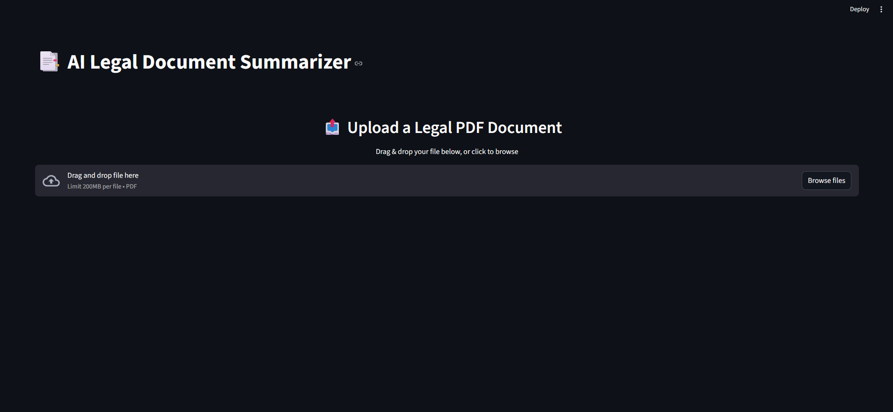
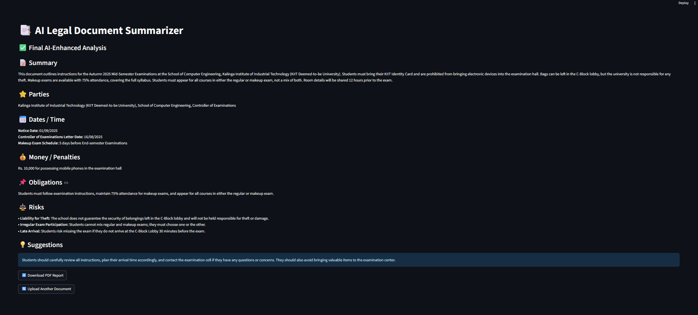

# ClauseIQ — Scalable RAG-based Legal Document Intelligence System

An AI-powered legal document intelligence platform that **extracts, analyzes, and summarizes legal documents** — and lets you **ask questions about them in natural language**.

It combines **OCR, NLP (spaCy, Regex), Groq LLaMA, Gemini Embeddings, and Pinecone** to deliver structured insights: parties, dates, obligations, money/penalties, risks, and suggestions — with a built-in **RAG Q&A engine** for deep document interrogation.

---

## ✨ Features

- **Text Extraction**
  - Extracts text from PDFs using `PyMuPDF` with `Tesseract OCR` fallback for scanned documents.

- **Entity Extraction**
  - Detects Parties, Dates/Times, Money/Penalties, and Obligations.
  - Uses **spaCy NER + Regex** — with separate clean and HTML-formatted variants for pipeline and metadata use.

- **Risk Analysis**
  - Identifies legal risks: termination clauses, confidentiality breaches, liabilities, IP disputes, dispute resolution, Indian jurisdiction clauses, and more.
  - Lightweight `extract_risk_categories()` for chunk-level Pinecone metadata tagging.

- **AI-Enhanced Summarization**
  - Refines summary, entities, and risks using **Groq LLaMA (llama3-8b-8192)**.
  - Grammar correction, OCR error fixing, and structured **JSON** output.

- **Metadata-Enriched RAG Chunking**
  - Each chunk tagged with extracted parties, dates, money, obligations, and risk categories via spaCy + Regex.
  - Enables precise semantic retrieval with Pinecone metadata filtering.

- **RAG-based Q&A**
  - Ask natural language questions about the uploaded document.
  - Powered by **Gemini Embeddings (`gemini-embedding-001`)** + **Pinecone** vector store + **Groq LLaMA**.
  - Returns answers with cited page numbers, confidence level, and caveats.
  - Per-document namespace isolation — no cross-document contamination.

- **Web App (Streamlit)**
  - Upload legal PDF documents.
  - Get structured AI-enhanced analysis (summary, parties, dates, risks, obligations, suggestions).
  - Ask questions about the document via built-in chat interface.
  - Export results as a professional **PDF report**.

---

## 📂 Project Structure

```
legal-doc-analyzer/
│── core/
│   ├── extraction.py       # PyMuPDF + Tesseract OCR fallback
│   ├── entities.py         # Entity extraction — clean + HTML variants
│   ├── risks.py            # Risk analysis + category tagging
│   ├── summarization.py    # Groq LLaMA summarization + JSON output
│   ├── pdf_writer.py       # Professional PDF report generation
│
│── rag/
│   ├── chunking.py         # Metadata-enriched chunking (spaCy + Regex)
│   ├── store.py            # Gemini embeddings + Pinecone upsert & retrieval
│   ├── qa.py               # RAG Q&A pipeline (Groq LLaMA)
│
│── data/
│   ├── input_docs/         # Input PDFs
│   ├── output_docs/        # Generated reports
│
│── tests/
│   ├── test_extraction.ipynb
│   ├── test_entities.ipynb
│   ├── test_risks.ipynb
│   ├── test_summarization.ipynb
│
│── app.py                  # Streamlit web app
│── requirements.txt        # Python dependencies
│── .env                    # API keys (not committed)
│── README.md
```

---

## ⚙️ Installation

### 1. Clone the repository
```bash
git clone https://github.com/yourusername/clauseiq.git
cd clauseiq
```

### 2. Create virtual environment
```bash
python -m venv venv
source venv/bin/activate   # Linux/Mac
venv\Scripts\activate      # Windows
```

### 3. Install dependencies
```bash
pip install -r requirements.txt
```

### 4. Set up environment variables
Create a `.env` file in the root directory:
```
GROQ_API_KEY=your_groq_key
GOOGLE_API_KEY=your_google_key
PINECONE_API_KEY=your_pinecone_key
```

### 5. Run the app
```bash
streamlit run app.py
```

---

## 📊 Example Output

### Upload Page


### Analysis Output


---

## 🛠 Tech Stack

| Layer | Technology |
|---|---|
| PDF Extraction | PyMuPDF, Tesseract OCR |
| NLP & Entities | spaCy, Regex |
| LLM | Groq LLaMA (llama3-8b-8192) |
| Embeddings | Google Gemini (gemini-embedding-001) |
| Vector Store | Pinecone (serverless) |
| Orchestration | LangChain |
| PDF Generation | ReportLab |
| Web App | Streamlit |

---

## 🚀 Future Improvements

- FastAPI backend + Next.js frontend for production deployment (Render + Vercel)
- Multi-language support for regional language contracts
- Clause-level risk scoring
- Bulk PDF processing
- Precedent case law retrieval via vector search